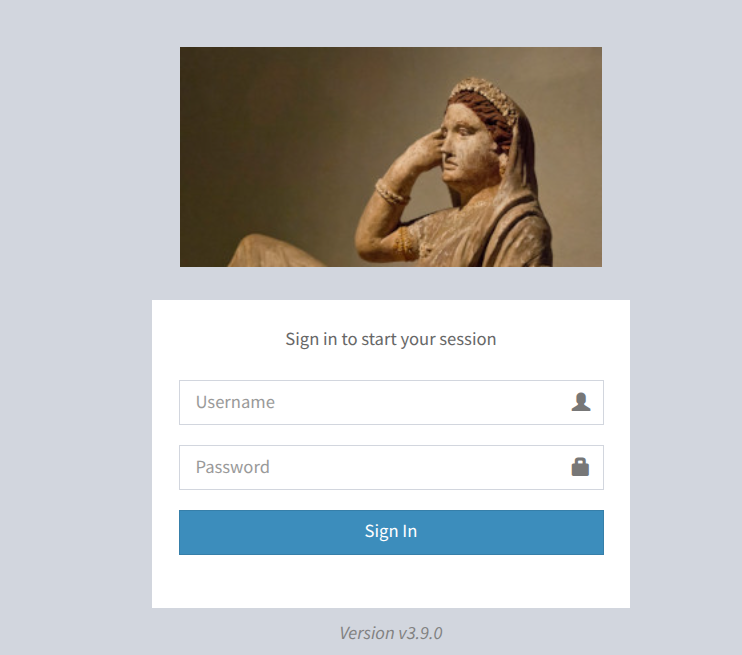
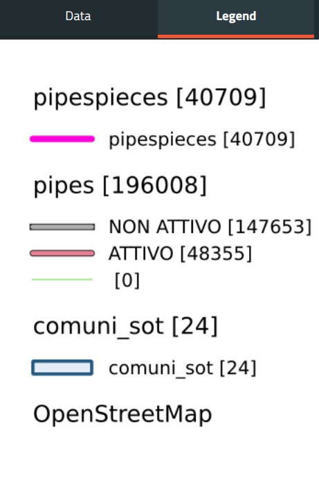

# Branding the G3W-Suite

The G3W-Suite is a web application that can be customized to match the look and feel of your organization. This section covers the branding options available.

It is beyond the scope of this section to explain how to customize the G3W-Suite's branding using the project UI options, since that is already covered in the relative section of the manual. This section will focus on how to customize the G3W-Suite's branding by editing the settings (```local_settings.py``` of the docker project) file in the source code and possibly some css settings.


## G3WSUITE_CUSTOM_STATIC_URL

Most of the style related settings depend on the ```G3WSUITE_CUSTOM_STATIC_URL``` attribute. This setting is a string that represents the URL from which **custom** static files are served. 

```python
G3WSUITE_CUSTOM_STATIC_URL = '/custom_static/'
```

This setting also needs a tweak in the ```config/nginx/locations``` file, when in production:

```nginx
location /custom_static/ {
    root /shared-volume/project_data/;
}
```

**NOTE:** When testing this in development/debug mode, the static folder **custom_static** needs to be created in the static folder of the **core** package of the g3w-admin app. 


In this case the setting needs to be adjusted to contain the static folder (note the initial static folder):

```python
G3WSUITE_CUSTOM_STATIC_URL = '/static/custom_static/'
```


## G3WSUITE_POWERD_BY

The powered by setting, turned on by default, shows information about the suite and the main developers behind it in the credits section, which is accessible from the top bar of the suite.

Without any interaction the section looks like this:


Adding the following line to the ```local_settings.py``` file will turn off the *powered by* section and show only what has been set in the **Map CLient Data** section of the **General Suite Data**:

```python
G3WSUITE_POWERD_BY=False
```


## Logos

When it comes to logos, 4 images can be customized:

- **G3WSUITE_MAIN_LOGO**: The logo that appears in the top left corner of the suite when logged in the admin section. Mind that this one needs to be around 200x60 pixels to fit nicely.
- **G3WSUITE_RID_LOGO**: The logo that appears in the top left corner of the suite when logged in the admin section, with the sidebar reduced. Mind that this one needs to be around 60x60 pixels to fit nicely.
- **G3WSUITE_LOGIN_LOGO**: The logo that appears on the login screen.
- **G3WSUITE_FAVICON**: The favicon of the suite.

The settings for these images are strings that represent the path to the image, relative to the **G3WSUITE_CUSTOM_STATIC_URL** setting.

```python
G3WSUITE_FAVICON = G3WSUITE_CUSTOM_STATIC_URL + 'favicon.ico'
G3WSUITE_MAIN_LOGO = G3WSUITE_CUSTOM_STATIC_URL + 'logo_main.png'
G3WSUITE_RID_LOGO = G3WSUITE_CUSTOM_STATIC_URL + 'logo_reduced.png'
G3WSUITE_LOGIN_LOGO = G3WSUITE_CUSTOM_STATIC_URL + 'logo_login.png'
```

This will lead to a login page like this:



and to the following admin logo icon:


and its reduced form:


## G3WSUITE_CUSTOM_TITLE

The title of the html page of the suite. Usually the title defaults to **g3w-admin** for the admin section and **g3w-client** for the webgis client.


By setting the following line in the ```local_settings.py``` file:

```python
G3WSUITE_CUSTOM_TITLE = "The Etruscan Webgis for the masses"
```

we get the following result:


## G3WSUITE_CUSTOM_CSS

The custom css setting is a string that represents the path to a custom css file that will be loaded in the suite. The path is relative to the **G3WSUITE_CUSTOM_STATIC_URL** setting:

```python
G3WSUITE_CUSTOM_CSS = [
    G3WSUITE_CUSTOM_STATIC_URL +'css/custom.css'
]
```

This custom css can be used to override some default suite css settings and allows for some great customization.

#### Example: remove sections form the main webgis view

Somethimes you do not need the metadata, print, bookmarks section:


Assume you want to remove everyting but the layer view. This can be done by adding the following css to the custom css file:

```css
/* remove the metadata section */
#metadata {
    display: none !important;
}
/* remove the bookmarks section */
#spatialbookmarks {
    display: none !important;
}
/* remove the search section */
#search {
    display: none !important;
}
/* remove the print section */
#print {
    display: none !important;
}
/* remove the "CHOOSE THEME" section */
#g3w-catalog-toc-layers-toolbar {
    display: none !important;
}
```

This results in the following view:


The same goes for most of the elements you can check out with the browser's inspector.

Do you want to remove the bottom map logo?


Then add the following css to the custom css file:

```css
#map_footer_left img{
    display: none !important;
}
```

This will remove the bottom map logo:


#### Example: change the skin color

To change the skin color of the suite, you can add the following css to the custom css file:

```css
:root {
    --skin-h: 0;
    --skin-s: 100%;
    --skin-l: 48%;
    --skin-color: hsl(var(--skin-h), var(--skin-s), var(--skin-l));
}
```

This will change the skin color to red (HSL values tested prior in [inkscape](https://inkscape.org/)).


### G3W_CLIENT_SEARCH_TITLE

The search section title in the webgis client can be customized by setting the following line in the ```local_settings.py``` file:

```python
G3W_CLIENT_SEARCH_TITLE = "Search for the Holy Grail"
```

This will help user to search for the Holy Grail:


### G3W_CLIENT_HEADER_CUSTOM_LINKS

The header custom links setting is a list of dictionaries that represent links that will be shown in the top bar of the webgis client. Each dictionary creates a new button,
using the icon and as tooltip the title of the dictionary. 

There can be two type of links, **url** and **modal**. The **url** type opens a new tab using the url provided in the dictionary, while the **modal** type opens a modal dialog containing the content provided in the dictionary.

```python
G3W_CLIENT_HEADER_CUSTOM_LINKS = [
    {
        'url': 'https://gis3w.it',
        'title': 'Gis3W company',
        'i18n': True,
        'target': '_blank',
        'img': 'https://gis3w.it/wp-content/uploads/2016/10/logo_qgis-1-100x100.png?x22227'
    },
    {
        "title": "Firefox me!",
        "content": "<div style='position: fixed; top: 10vh; left: 50%; transform: translateX(-50%); background: white; width: 60%; max-width: 600px; min-height: 200px; max-height: 80vh; padding: 20px; border-radius: 10px; box-shadow: 0px 4px 10px rgba(0, 0, 0, 0.3); text-align: center; overflow: auto;'><p>Html example content to show in modal</p></div>",
        "type": "modal",
        "position": 10,
        "img": "https://img.icons8.com/external-those-icons-flat-those-icons/96/external-Firefox-logos-and-brands-those-icons-flat-those-icons.png"
    },
]
```

The **i18n** key is used to translate the title of the link. If set to True, the title will be translated (if possible) using the suite's translation system.

The above example creates changes the top bar from:


to:


While ths first link opens a new tab with the Gis3W company website, the second link opens a modal dialog like this:


### G3W_CLIENT_RIGHT_PANEL

The right panel width can be set with the following setting:

```python
G3W_CLIENT_RIGHT_PANEL = {
    'width': 50
}
```

The width is the percentage of the map view that will be dedicated to the right panel. 


### G3W_CLIENT_LEGEND

It is possible to customize the legend of the webgis client to some extent. The following settings are available:

```python
G3W_CLIENT_LEGEND = {
    "layerfontsize": 20, # layer title font size
    "itemfontsize": 16, # legend rules font size
    'color': 'black', # all text font color
    'transparent': False, # if false, makes a white background
    'boxspace': 10,  # insets around legend
    "layerspace": 8, # space between layers
    'layertitlespace': 4, # space between layer title and rules
    'symbolspace': 4, # spacing between rules
    'iconlabelspace': 5, # spacing between icon and rule name
    'symbolwidth': 18, # width of the icon
    'symbolheight': 4,  # height of the icon
    "showfeaturecount": True  # show the number of features in the legend
}
```

This would change the legend from:


to:




