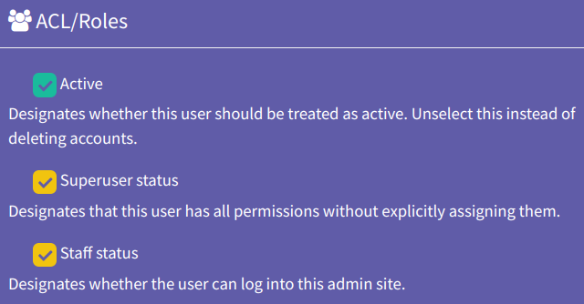
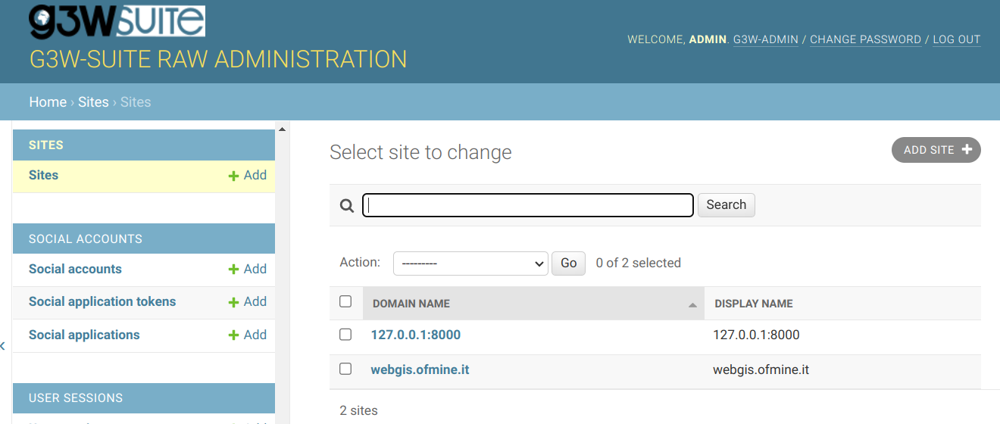
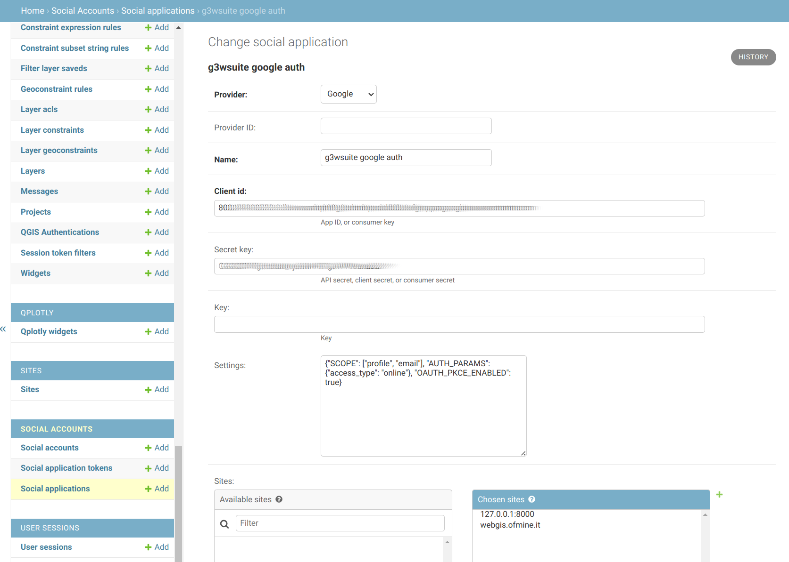
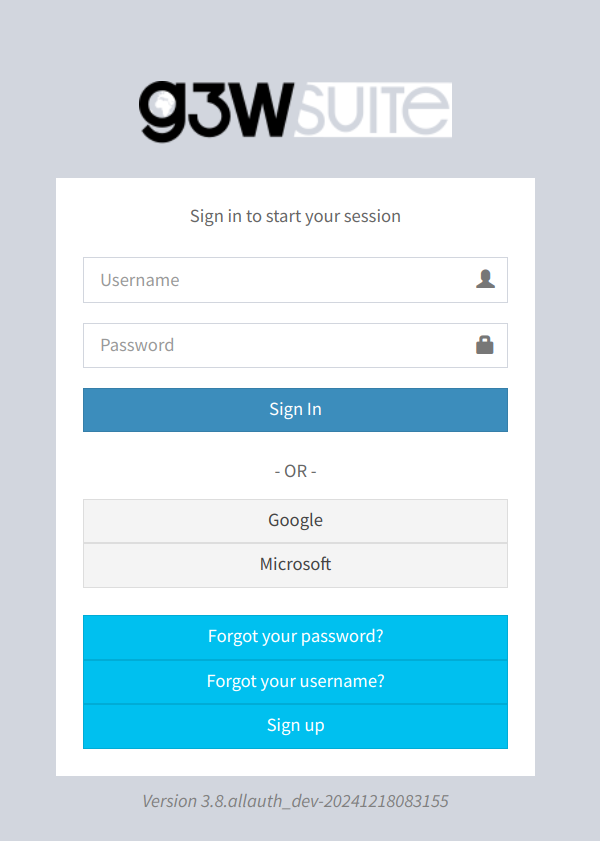
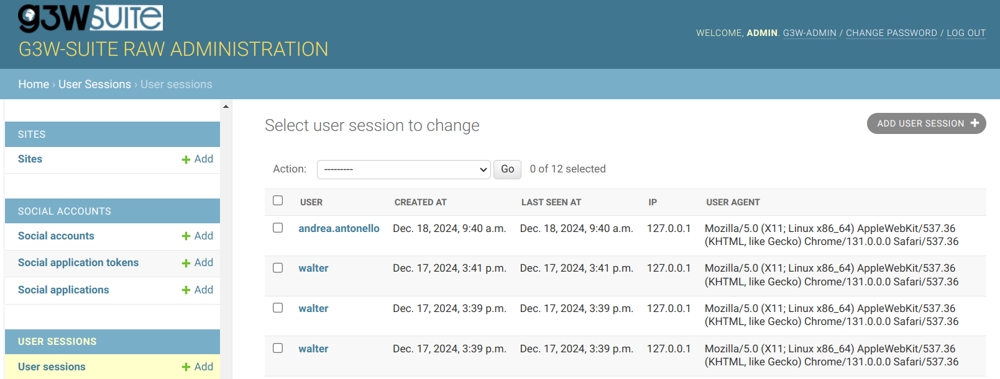

# Social Account Authentication in the G3W-Suite with django-allauth

Since version 3.9 of the G3W-Suite authentication using social accounts is supported 
using the [django-allauth](https://django-allauth.readthedocs.io/en/latest/) library.

The Suite comes with all necessary django apps preinstalled and a few providers 
configured, but can be extended as per user needs with any provider supported 
by ```django-allauth```.

Once social applications have been added to the django settings, the login button 
for each added application will appear on the suite's login screen.

To be able to configure social account authentication, the user needs to have the 
priviledges of both superuser and staff (admin level 1). Make sure that the
user's ACL look like this:



Let's have a look at the workflow to properly configure the social authentication in 
the suite.

## Add necessary providers

The first step is to make sure the needed provider modules are enabled. By default
the suite enbles the google and microsoft providers as they have been added 
together with the allauth modules in the base settings:

```python
THIRD_PARTY_APPS = [
    ...
    ...

    "allauth",
    "allauth.account",
    "allauth.socialaccount",
    "allauth.socialaccount.providers.microsoft",
    "allauth.socialaccount.providers.google",
    "allauth.usersessions"
]
```

To add additional providers (Gitlab, Github, Twitter, Facebook, etc) to the game,
we can just add them in the ```local_settings.py``` under the ```G3WADMIN_LOCAL_MORE_APPS```
sectting. For example, to add facebook as a provider, just add:

```python
G3WADMIN_LOCAL_MORE_APPS = [
    ...
    ...

    "allauth.socialaccount.providers.facebook",
]
```

Adding providers alone will not change anything visible in the authentication workflow.
It will be necessay to also acc social applications to the django settings.

## Set the site id

The base settings of the suite have a site id configured as 1.

```python
SITE_ID = 1
```

While this can be fine for some cases, usually one needs to differentiate at least 
two sites in development and production environments. 



In these cases it is necessary to override the site setting with the currently used
site id.

## Add the social apps

Social apps are the settings that in fact enable providers to be used for authentication.

It is beyond the scope of this manual to explain how to enable social applications
on the provider's cloud consoles. The allauth documentation has a small entry for each 
provider. [The example at this link](https://docs.allauth.org/en/latest/socialaccount/providers/google.html), which describes how to configure a social application
using the Google provider can help the reader to understand the following 
image.



Once the social application is (properly configured and) saved, the login button
of the chosen provider will appear on the suite's login screen.



## Social account corner cases

### Automatic user registration via social account login

Authorized users (by the provider) that login for the first time to the suite,
transparently are registered to the system. For this to work, it is necessary to assign them
to one of the user roles available in the suite:

* Editor Level 1
* Editor Level 2
* Viewer Level 1
* Viewer Level 2

If no role is set, the _Viewer Level 1_ is automatically set to the new registered user.
It is possible to tweak this setting by overriding the setting:

```python
SOCIALACCOUNT_USER_ROLE = 'Editor Level 1'
```

The admin roles have to be manually set, if necessary. Any typo in this setting or 
admin role choice will fallback to the default viewer role.

**Note that the username in this case will be retrieved from the provider.**

### Linking social authentication to existing suite users

It is also possible to connect social accounts to existing users. The match
in this case occurrs through the email address. The username of the original 
suite user is kept and the provider supplied username is ignored in this case.


# User Session Tracking

The social account integration also brings the possibility to enable 
user sessions tracking.

To enable it the following setting can be overridden in the local_settings.py:

```python
USERSESSIONS_TRACK_ACTIVITY = True
```

Once enabled the django admin will provide the following view:




